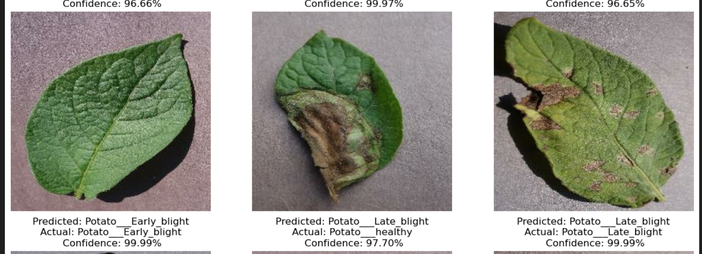

# Potato-Leaf-Disease-Detection-using-CNN

A deep learning project that detects **Potato Leaf Diseases** using a Convolutional Neural Network (CNN).  
The model classifies leaf images into:

- **Potato___Early_blight**
- **Potato___Late_blight**
- **Potato___healthy**

---

## 📈 Model Performance

Trained for **20 epochs**, the model achieved:

- **Training Accuracy:** 95.29%  
- **Validation Accuracy:** 97.40%  
- **Training Loss:** 0.1201  
- **Validation Loss:** 0.0673  


---

## 📊 Sample Predictions

Below is a visual example of model predictions, including predicted class, actual class, and confidence:




---

## 🧠 Model Architecture

The CNN architecture includes:

- Image Resizing & Rescaling layers  
- Data Augmentation (flip, rotation)  
- Multiple Conv2D + MaxPooling layers  
- Dense layers with ReLU activation  
- Softmax layer with 3 output classes  

Frameworks used:

- **TensorFlow / Keras**
- **NumPy**
- **Matplotlib**

---

## 📂 Dataset

Dataset classes:
Potato___Early_blight
Potato___Late_blight
Potato___healthy


Data split:

- `train/`
- `val/`
- `test/`

Data augmentation applied:

- RandomFlip  
- RandomRotation  
- Normalization (1./255)

---

## 🚀 Usage

### 1️⃣ Clone the Repository
```bash
git clone https://github.com/<your-username>/potato-leaf-disease-cnn.git
cd potato-leaf-disease-cnn

